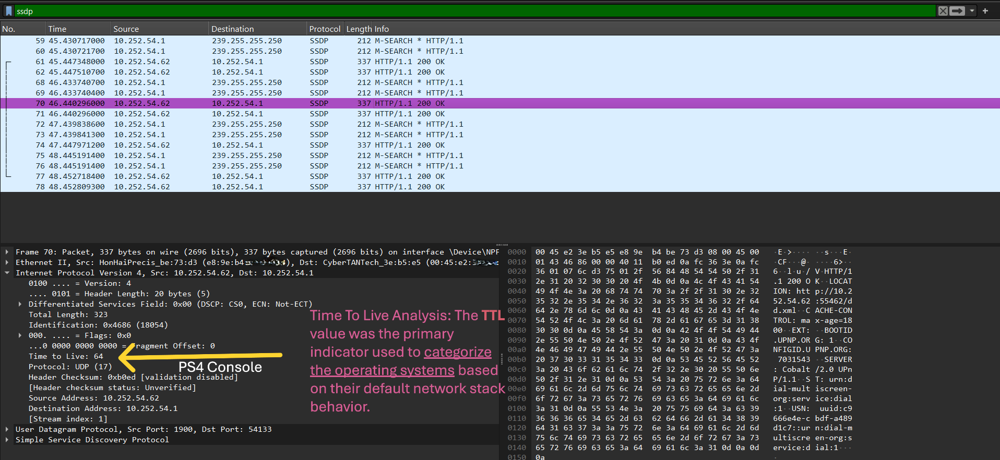
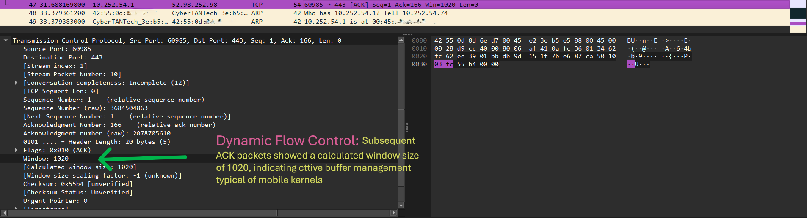

# 🔍 Network Assets Fingerprinting & Forensic Analysis

## 🎯 Project Overview
In this lab, I conducted a **Digital Forensics** investigation to identify and profile diverse network assets (Windows, Android, and PS4) within a local subnet. The goal was to demonstrate how to distinguish between operating systems using passive and active traffic analysis.

## 🛠️ Investigation Methodology
### 1. Identifying the PlayStation 4 (Console)
Identifying the PS4 was a challenge because it shares the same **TTL (64)** as Android. I successfully verified the device using:
* **MAC OUI Analysis:** Identified as **Hon Hai Precision (Foxconn)**, the manufacturer for Sony.
* **SSDP Discovery:** Captured outgoing UDP packets to confirm the device identity.

### 2. OS Profiling Table
| Device | IP Address | TTL | Identified OS | Forensic Indicator |
| :--- | :--- | :--- | :--- | :--- |
| **Laptop** | `10.252.54.1` | 128 | Windows 10/11 | Standard TCP Stack |
| **PS4** | `10.252.54.62` | 64 | Orbis OS (FreeBSD) | MAC OUI: Hon Hai |
| **Mobile** | `10.252.54.74` | 64 | Android | Linux Kernel Behavior |

### 3. Advanced Analysis: Window Size
I analyzed the **TCP Window Size** to observe how different kernels manage data flow control.

## 🏁 Conclusion
This project proves the ability to detect and categorize network assets without direct access, providing critical visibility for **SOC Analysts** during an incident response.
